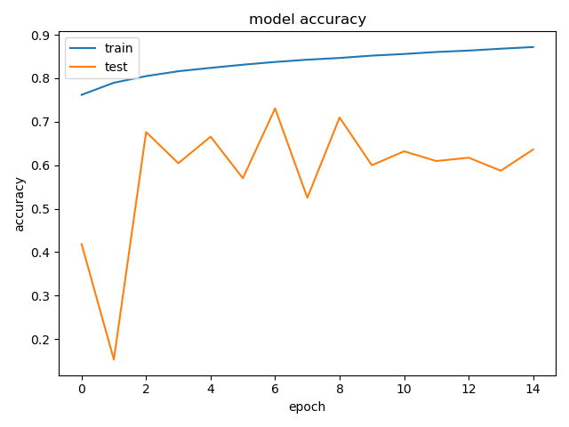
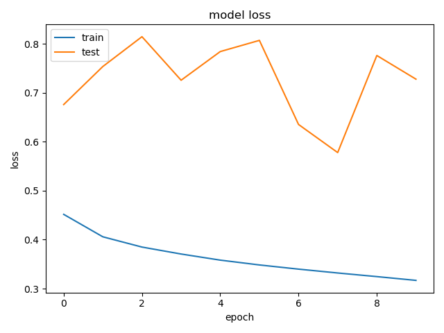
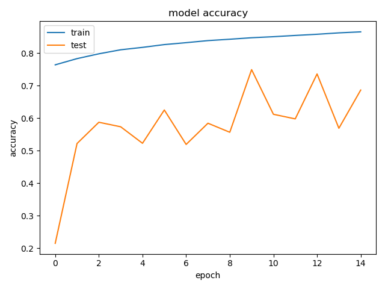
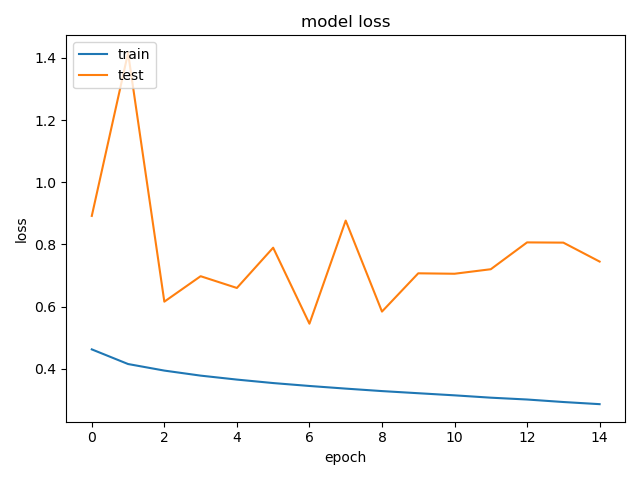
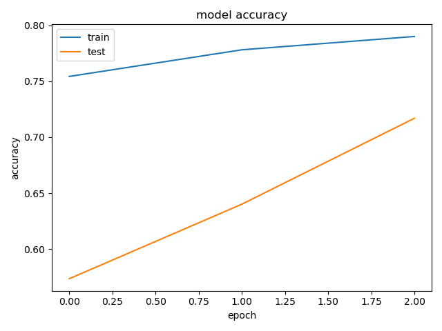

# Classifiers 

Keeping track here of the experiments with different classifiers and their performances. 
 
 

--- 
### Vanilla NN 
Feed-forward neural network.  
Takes as input a sentence embedding. 
#### Experiment 1 
- Structure: 3 dense layers :  
    64 -> 64 -> 2 
- Vocabulary used: vocab.pkl
- Embedding: Glove
- Using pre-trained embedding: False
- Performance: <record here accuracy / f1 score> 
#### Experiment 2 
- Structure: 3 dense layers :  
    64 -> 64 -> 2 
- Vocabulary used: vocab.pkl
- Embedding: Glove
- Using pre-trained embedding: True 
- Performance: <record here accuracy / f1 score> 
 
 

--- 
### Recurrent net 
Takes as input the sentence as a sequence of tokens. Each token represents the index of 
the word in the vocabulary in use. The association of each word with its embedding is 
performed by an *Embedding layer* inside the network. The Embedding layer can be pre-loaded 
with a given embedding matrix. Furthermore, the embedding layer can be fine-tuned during 
training. 

#### Experiment 1 : "Recurrent_1L_GRU"
- Structure:

        |Embedding|| 
        ||Recurrence + 0.4 dropout|| 
        ||Dropout|| 
        ||Dense -64||
        ||Batch normalization||
        ||Dense -2||
        
        Note: using all that regularization because the net 
        was overfitting on the training set. 
   
- Vocabulary used: vocab.pkl
- Embedding: Glove
- Using pre-trained embedding: True 
- Trained embedding further: False
- Performance: 
    
    
    

- Training details: 
        
        train_params={"epochs":15,
                        "batch_size":32,
                        "validation_split":0.3}
- Other build details: 

        build_params = {
                    "cell_type":"GRU",
                    "num_layers":1,
                    "hidden_size":64,
                    "optimizer":"adam",
                    "dropout_rate":0.4,
                    "use_normalization":True}

#### Experiment 1 : "Recurrent_1L_LSTM"
- Structure:

        |Embedding|| 
        ||Recurrence + 0.4 dropout|| 
        ||Dropout|| 
        ||Dense -64||
        ||Batch normalization||
        ||Dense -2||
        
        Note: using all that regularization because the net 
        was overfitting on the training set. 
   
- Vocabulary used: vocab.pkl
- Embedding: Glove
- Using pre-trained embedding: True 
- Trained embedding further: False
- Performance: 

- Training details: 
        
        train_params={"epochs":15,
                        "batch_size":32,
                        "validation_split":0.3}
- Other build details: 

        build_params = {
                    "cell_type":"LSTM",
                    "num_layers":1,
                    "hidden_size":64,
                    "optimizer":"adam",
                    "dropout_rate":0.4,
                    "use_normalization":True}

#### Experiment 3 : "Attention_GRU"

The idea comes from [this](https://arxiv.org/pdf/1703.03130.pdf) paper.  
> Self-Attention (SA), a variant of the attention mechanism, 
>was proposed by Zhouhan Lin, et. al (2017) to overcome 
>the drawback of RNNs by allowing the attention mechanism to 
>focus on segments of the sentence, where the relevance of the 
>segment is determined by the contribution to the task.

- Structure:

From part (a) in the above diagram, we can see the entire architecture of the self-attention model.  
The embedded tokens (w’s in the above) are fed into bidirectional LSTM layers (h’s). 
Hidden states are weighted by an attention vector (A’s) to obtain a refined sentence representation 
(M in the above) that is used as an input for the classification.
Part (b) of the diagram illustrates how to get the attention weights, proceeding from top to bottom. 
To begin with the collection of hidden states, it is multiplied by a weight matrix, and is f
ollowed by tanh layer for non-linear transformation. 
And then another linear transformation is applied to the output with another 
weight matrix to get the pre-attention matrix. A softmax layer, which is applied 
to the pre-attention matrix in the row-wise direction, making its weights looking 
like a probability distribution over the hidden states.
   
- Vocabulary used: vocab.pkl
- Embedding: Glove
- Using pre-trained embedding: True 
- Trained embedding further: False
- Performance: <record here accuracy / f1 score> 

- Training details:     

            train_params={"epochs":15,
                         "batch_size":32,
                         "validation_split":0.3}
                         
- Other build details: 

            build_params = {
                        "cell_type":"GRU",
                        "num_layers":1,
                        "hidden_size":64,
                        "optimizer":"adam",
                        "dropout_rate":0.4,
                        "use_normalization":True,
                        "use_attention":True}
[Here](https://medium.com/apache-mxnet/sentiment-analysis-via-self-attention-with-mxnet-gluon-dc774d38ba69) is a link 
to a Medium article that explains the implementation of self-attention.
 
 

--- 