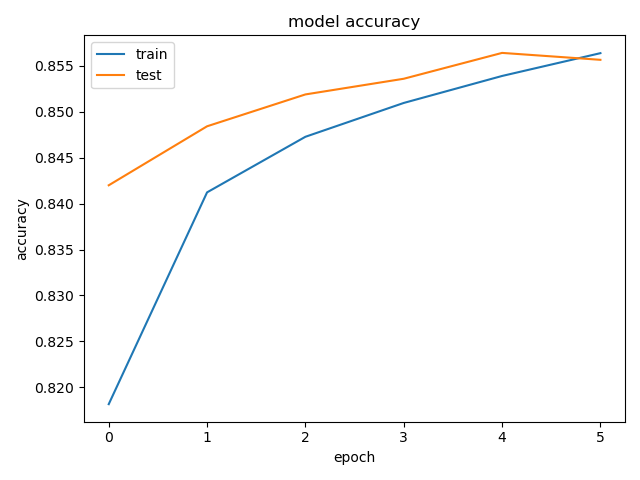
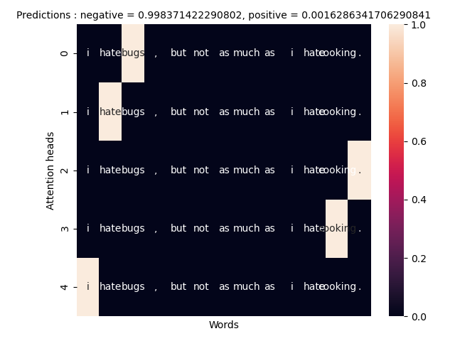
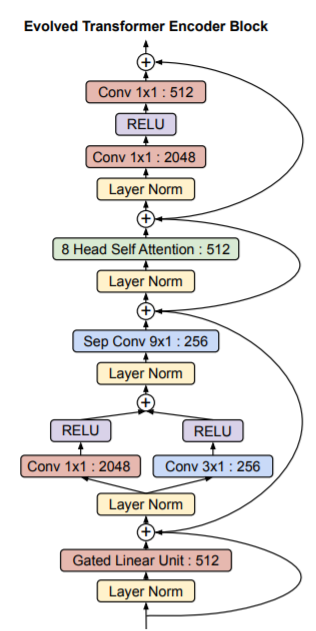

# Classifiers 

Keeping track here of the experiments with different classifiers and their performances. 
 
 

--- 
### Vanilla NN 
Feed-forward neural network.  
Takes as input a sentence embedding. 
#### Experiment 1 
- **Structure**: 3 dense layers :  
    64 -> 64 -> 2 
- **Vocabulary used**: vocab.pkl
- **Embedding**: Glove
- **Using pre-trained embedding**: False
- **Performance**: <record here accuracy / f1 score> 
#### Experiment 2 
Same experiment as above, using pre-trained embedding. 
- **Using pre-trained embedding**: True 
- **Performance**: <record here accuracy / f1 score> 

--- 
### Recurrent net 
Takes as input the sentence as a sequence of tokens. Each token represents the index of 
the word in the vocabulary in use. The association of each word with its embedding is 
performed by an *Embedding layer* inside the network. The Embedding layer can be pre-loaded 
with a given embedding matrix. Furthermore, the embedding layer can be fine-tuned during 
training. 

#### Experiment 1 : "Recurrent_1L_GRU"
- **Structure**:

        |Embedding|| 
        ||Recurrence + 0.4 dropout|| 
        ||Dropout|| 
        ||Dense -64||
        ||Batch normalization||
        ||Dense -2||
        
        Note: using all that regularization because the net 
        was overfitting on the training set. 
   
- **Vocabulary used**: vocab.pkl
- **Embedding**: Glove
- **Using pre-trained embedding**: False
- **Trained embedding further**: False
- **Performance**: 
 

- **Training details**: 
        
        train_params={"epochs":15,
                        "batch_size":32,
                        "validation_split":0.3}
- **Other build details**: 

        build_params = {
                    "cell_type":"GRU",
                    "num_layers":1,
                    "hidden_size":64,
                    "optimizer":"adam",
                    "dropout_rate":0.4,
                    "use_normalization":True}

#### Experiment 1.2 : "Recurrent_2L_GRU"
- **Structure**: same as above, just using 2 recurrent layers. 
- **Vocabulary used**: full_vocab_in_stanford.pkl
- **Embedding**: Necessary Stanford
- **Using pre-trained embedding**: True
- **Trained embedding further**: False
- **Input text replacement**: Stanford replacer
- **Input text lemmatization**:False
- **Kaggle lederboard score** : 0.83800
- **Training details**:     
Trained on 600000 samples, validated against 150000 samples and tested against 75000 samples. 
 Also, trained with *Early Stopping* on. 

        np.random.seed(42)
        
        train_params = {"epochs": 10,
                        "batch_size": 1024,
                        "validation_split": 0.2,
                        "use_categorical": True}
                        
- **Other build details**: 

        build_params = {"train_embedding": False,
                        "use_pretrained_embedding": True,
                        "cell_type":"GRU",
                        "num_layers":2,
                        "hidden_size":64,
                        "optimizer":"adam",
                        "dropout_rate":0.4,
                        "use_normalization":True
                        }

#### Experiment 2 : "Recurrent_1L_LSTM"
Same experiment as above, using LSTM cells instead of GRU.
- **Performance**: 

- **Other build details**: 

        build_params = {
                    "cell_type":"LSTM",
                    "num_layers":1,
                    "hidden_size":64,
                    "optimizer":"adam",
                    "dropout_rate":0.4,
                    "use_normalization":True}

#### Experiment 3 : "Attention_GRU_full"

The idea comes from [this](https://arxiv.org/pdf/1703.03130.pdf) paper.  
> Self-Attention (SA), a variant of the attention mechanism, 
>was proposed by Zhouhan Lin, et. al (2017) to overcome 
>the drawback of RNNs by allowing the attention mechanism to 
>focus on segments of the sentence, where the relevance of the 
>segment is determined by the contribution to the task.

- **Structure**:

From part (a) in the above diagram, we can see the entire architecture of the self-attention model.  
The embedded tokens (w’s in the above) are fed into bidirectional LSTM layers (h’s). 
Hidden states are weighted by an attention vector (A’s) to obtain a refined sentence representation 
(M in the above) that is used as an input for the classification.
Part (b) of the diagram illustrates how to get the attention weights, proceeding from top to bottom. 
To begin with the collection of hidden states, it is multiplied by a weight matrix, and is f
ollowed by tanh layer for non-linear transformation. 
And then another linear transformation is applied to the output with another 
weight matrix to get the pre-attention matrix. A softmax layer, which is applied 
to the pre-attention matrix in the row-wise direction, making its weights looking 
like a probability distribution over the hidden states.
   

- **Vocabulary used**: full_vocab_in_stanford.pkl
- **Embedding**: Necessary Stanford
- **Using pre-trained embedding**: True
- **Trained embedding further**: False
- **Input text replacement**: Stanford replacer
- **Input text lemmatization**:False
- **Kaggle lederboard score**: 0.84400
- **Performance - batch size = 1024**: 
 

- **Training details**:     

Trained on 600000 samples, validated against 150000 samples and tested against 75000 samples. 

    np.random.seed(42)
    
    train_params = {"epochs":10,
                    "batch_size":1024,
                    "validation_split":0.2,
                    "use_categorical":True}
                         
- **Other build details**: 

            build_params = {
                        "cell_type":"GRU",
                        "num_layers":1,
                        "hidden_size":128,
                        "optimizer":"adam",
                        "dropout_rate":0.4,
                        "use_normalization":True,
                        "use_attention":True, 
                        "heads":1}
         
                        
[Here](https://medium.com/apache-mxnet/sentiment-analysis-via-self-attention-with-mxnet-gluon-dc774d38ba69) is a link 
to a Medium article that explains the implementation of self-attention.

#### Experiment 4 : "Attention_GRU_5heads_full"

Same as the above experiment, using 5 attention heads instead of 1. 

        build_params = {
                "cell_type":"GRU",
                "num_layers":1,
                "hidden_size":128,
                "optimizer":"adam",
                "dropout_rate":0.4,
                "use_normalization":True,
                "use_attention":True,
                "heads":5, # number extracted from section 4.4.2 of the paper
                "penalization":False
            }
            
- **Performance**: 
 

- **Visualization**: 
Here's an heatmap visualization of the role of the 5 attention heads.  
Each row corresponds to a different attention head, and should hence capture a different "aspect" of the sentence. 
The heatmap shows the relative weights that each word is given by the attention head: the higher the weight, the more 
*"attention"* the word will receive at classification time.

For comparison, here is the heatmap of an untrained model: 

 
And here is the heatmap of this trained model:

#### Experiment 4 : "Attention_GRU_5heads_penalized"

Same as the above, including penalization for the weight matrix A to encourage diversity. 
> The embedding matrix M can suffer from redundancy problems if the attention 
> mechanism always provides similar summation weights for all the r hops. 
> Thus we need a penalization term to encourage the diversity of summation 
> weight vectors across different hops of attention. 

- **Vocabulary used**: full_vocab_in_stanford.pkl
- **Embedding**: Necessary Stanford
- **Using pre-trained embedding**: True
- **Trained embedding further**: False
- **Input text replacement**: Stanford replacer
- **Input text lemmatization**:False
- **Kaggle lederboard score** : 0.83480
- **Performance - batch size = 1024**: 

  

- **Test results** : 
     
            Testing model
            Accuracy: 0.853253
            Precision: 0.801892
            Recall: 0.888919
            F1 score: 0.843166
            Cohens kappa: 0.705972
            ROC AUC: 0.937159
            Confusion matrix>
                [[34409  7309]
                 [ 3697 29585]]
                 
                 
- **Model worst mistakes**: 

| False negatives  | False positives  |
| ------------- | ------------- | 
| and the winner of ' nowruz giveaway ' is . <repeat> lorri davey ! congrats lorri ( it let me tag . <repeat> <url>   | hey waiting guy with the cute smile |
| i feel hurt really hurt  | beautiful day to . <repeat> mow the lawn . yea . i am so thrilled . |
| textin and driving ( the ultimate death trap | im listening to co jams|
| mean girls and coffee . <hashtag> sick <hashtag> waah <hashtag> fml | <user> thank you , very sweet .   |
| heartbreak brit hate to see em ' so sad  | now following <user> follow bakk n m ur lucky <number> th follower lol  |
               
- **Training details**:     
Trained on 600000 samples, validated against 150000 samples and tested against 75000 samples. 
 Also, trained with *Early Stopping* on. 

            np.random.seed(42)      
            
            
            train_params = {"epochs":10,
                            "batch_size":128,
                            "validation_split":0.2,
                            "use_categorical":True}         
                                       
- **Build params**:                         

           build_params = {"train_embedding": False,
                            "use_pretrained_embedding": True,
                            "cell_type": "GRU",
                            "num_layers": 1,
                            "hidden_size": 64,
                            "optimizer": "adam",
                            "use_convolution": False,
                            "num_conv_layers": 6,
                            "threshold_channels": 600,
                            "penalization": True,
                            "gamma":0.1,
                            "use_attention": True,
                            "heads":5,
                            "dropout_rate": 0.4,
                            "use_normalization": True}
                                    
            # More on penalization:
            # we are penalizing the distance from the identity matrix
            # of the dot product of our weight matrix by itself: 
            # we are encouraging the dot product of two different 
            # attention heads to be 0  
            --> disentangling the different factors of attention

- **Trainable params**: 152,066

- **Visualization**: 

 
From the heatmap it's clear that the visualization is working: 
as stated before the role of the penalization is to decouple the attention heads as much as possible. 
Comparing the results of the penalized version to those of the standard attention version (with the same number 
of attention heads := 5) we get markedly less juxtaposition between the heads in the penalized version.

#### Experiment 5 : "Attention_GRU_penalised_convolution"

The idea comes from [the same](https://arxiv.org/pdf/1703.03130.pdf) paper on self attention mentioned before.  

- **Structure**:
Referring to the diagram showed in *Experiment 3*, the focus of this experiment is on the connection 
between the *timesteps x heads* matrix and the dense layer above.  
Instead of flattening the input into one dimension we would like to preserve the information 
in the structure. We do this by convolving the input along each head dimension. For each convolution
we double the number of channels (= number of heads in the beginning) and halve the length of the 
input (= hidden dimension x 2 in the beginning), and we keep convolving until we get lenght 1 on each 
channel. The output of the convolution will be of dimension [batch size x channels x 1], which can be 
directly fed into the dense head. 

- **Vocabulary used**: full_vocab_in_stanford.pkl
- **Embedding**: Necessary Stanford
- **Using pre-trained embedding**: True
- **Trained embedding further**: False
- **Input text replacement**: Stanford replacer
- **Input text lemmatization**:False
- **Kaggle lederboard score** : 0.8410
- **Performance - batch size = 1024**: 

  

- **Test results** : 
        
            Accuracy: 0.856573
            Precision: 0.836888
            Recall: 0.840635
            F1 score: 0.838757
            Cohens kappa: 0.709602
            ROC AUC: 0.938773
            [[36265  5453]
             [ 5304 27978]]
                             
- **Model worst mistakes**: 

| False negatives  | False positives  |
| ------------- | ------------- | 
| t r ( e a t ] her right ! <hashtag> perfectly imperfect . <repeat>   |  <hashtag> food , sleeping , breathing , bears and the <hashtag> epic face ) |
| i feel hurt really hurt  |trend <hashtag> beliebers have a new video today " boyfriend " and directioners <user>  |
| luggage handed in ! officially ready for disney ( ( ( <hashtag> cannotwait <hashtag> disney <number> | hey waiting guy with the cute smile  |
| mean girls and coffee . <hashtag> sick <hashtag> waah <hashtag> fml | now following <user> follow bakk n m ur lucky <number> th follower lol |
| have to admit , and i mean this constructively , surprised by how sterile getting ( relative to other great cities . <repeat> | is very good for the health . )     |
                                       
                            

- **Training details**:     
Trained on 600000 samples, validated against 150000 samples and tested against 75000 samples. 
 Also, trained with *Early Stopping* on. 

            np.random.seed(42)
            
            train_params = {"epochs":10,
                            "batch_size":128,
                            "validation_split":0.2,
                            "use_categorical":True}
            
                         
- **Other build details**: 

            build_params = {"train_embedding": False,
                            "use_pretrained_embedding": True,
                            "cell_type": "GRU",
                            "num_layers": 1,
                            "hidden_size": 64,
                            "optimizer": "adam",
                            "use_convolution": True,
                            "num_conv_layers": 6,
                            "threshold_channels": 600,
                            "penalization": True,
                            "gamma":0.1,
                            "use_attention": True,
                            "heads":5,
                            "dropout_rate": 0.4,
                            "use_normalization": True}
                            
- **Visualization**: 

                    

- **Trainable params**: 1,156,436

--- 

#### Experiment 6 : "convolution_3_pool"

Using a convolutional network to extract the features from the sentence, 
represented through the Stanford embedding.

- **Vocabulary used**: full_vocab_in_stanford.pkl
- **Embedding**: Necessary Stanford
- **Using pre-trained embedding**: True
- **Trained embedding further**: False
- **Input text replacement**: Stanford replacer
- **Input text lemmatization**:False
- **Kaggle lederboard score** : 0.52480 - we should double check here, there might be something wrong with the experiment.
- **Performance - batch size = 1024**: 

  

- **Test results** : 
        
            Accuracy: 0.850000
            Precision: 0.855470
            Recall: 0.796557
            F1 score: 0.824963
            Cohens kappa: 0.694025
            ROC AUC: 0.937990
            Confusion matrix: 
                [[37239  4479]
                 [ 6771 26511]]
                 
                 
- **Model worst mistakes**: 

| False negatives  | False positives  |
| ------------- | ------------- | 
| when worst comes to worst talk to your dog   |  <user> great hope it improves later , thanks ! |
| i feel hurt really hurt  |<number> / <number> rt <user> i absolutely love my view , <number> / <number> . <repeat> your view ? hahahaha . |
| i over slept woke up ate now back in bed feels good not going to school lol buh i gotta go tomorow <hashtag> fml  | royals like and spread our official account in fb ! <url> po kasi yung ntin|
| mean girls and coffee . <hashtag> sick <hashtag> waah <hashtag> fml | <user> thank you , very sweet .   |
| have to admit , and i mean this constructively , surprised by how sterile getting ( relative to other great cities . <repeat> | now following <user> follow bakk n m ur lucky <number> th follower lol  |
                                       

- **Training details**:     
Trained on 600000 samples, validated against 150000 samples and tested against 75000 samples. 
 Also, trained with *Early Stopping* on. 

            np.random.seed(42)
            
            train_params = {"epochs":10,
                            "batch_size":128,
                            "validation_split":0.2,
                            "use_categorical":True}
            
                         
- **Other build details**: 

            build_params = {"train_embedding": False,
                            "use_pretrained_embedding": True,
                            "use_pooling": True,
                            "pooling_type": "max",
                            "num_convolutions": 3,
                            "window_size": 5,
                            "dilation_rate": 1,  # no dilation
                            "pool_size": 2,
                            "hidden_size": 128,
                            "dropout_rate": 0.4,
                            "use_normalization": True,
                            "optimizer": "adam"
                            }
 
 - **Trainable params**: 852,386

#### Experiment 6.2 : "convolution_10_pool"

Same as above, with 10 convolutions.

- **Vocabulary used**: full_vocab_in_stanford.pkl
- **Embedding**: Necessary Stanford
- **Using pre-trained embedding**: True
- **Trained embedding further**: False
- **Input text replacement**: Stanford replacer
- **Input text lemmatization**:False
- **Kaggle lederboard score** : 0.52480 - we should double check here, there might be something wrong with the experiment.
- **Performance - batch size = 1024**: 

- **Test results** : Still running 
        
     
- **Model worst mistakes**: 

- **Training details**:     
Trained on 600000 samples, validated against 150000 samples and tested against 75000 samples. 
 Also, trained with *Early Stopping* on. 

            np.random.seed(42)
            
            train_params = {"epochs":10,
                            "batch_size":128,
                            "validation_split":0.2,
                            "use_categorical":True}
            
                         
- **Other build details**: 

            build_params = {"train_embedding": False,
                            "use_pretrained_embedding": True,
                            "use_pooling": True,
                            "pooling_type": "max",
                            "num_convolutions": 10,
                            "window_size": 5,
                            "dilation_rate": 1,  # no dilation
                            "pool_size": 2,
                            "hidden_size": 128,
                            "dropout_rate": 0.4,
                            "use_normalization": True,
                            "optimizer": "adam"
                            }
 
 - **Trainable params**: 852,386

                                          
                            

#### Experiment 7 : "GRU_128_conv"

Using a bidirectional recurrent net and convolving the sequence outputs to get 
a representation for the sequence to use for classification. 

- **Vocabulary used**: full_vocab_in_stanford.pkl
- **Embedding**: Necessary Stanford
- **Using pre-trained embedding**: True
- **Trained embedding further**: False
- **Input text replacement**: Stanford replacer
- **Input text lemmatization**:False
- **Kaggle lederboard score** : 0.8410
- **Performance - batch size = 1024**: 

  

- **Test results** : 
        
            Accuracy: 0.856787
            Precision: 0.857193
            Recall: 0.812661
            F1 score: 0.834333
            Cohens kappa: 0.708371
            ROC AUC: 0.941086
            Confusion matrix: 
                [[37212  4506]
                 [ 6235 27047]]
                 
- **Model worst mistakes**: 

| False negatives  | Confidence | False positives  |  Confidence |
| ------------- | ------------- | ------------- | ------------- |
| ( ( ( going to prom with a <number> better prom date ever > > > |  0.9999643564224243  | <hashtag> lt my twinn should know my whole name too )      | 0.9999666213989258  |
| <user> you can download from youtube with ( <url> or the website save youtube ( <url> | 0.9999662637710571  |a smile can hide everything but u smile forever  | 0.9999697208404541  |
| mean girls and coffee . <hashtag> sick <hashtag> waah <hashtag> fml  | im listening to co jams  | 0.9999762773513794|
| heartbreak brit hate to see em ' so sad | 0.999991774559021  |bouta play music & think about my girl '| 0.9999829530715942 |
| i feel hurt really hurt | 0.9999985694885254  |hey waiting guy with the cute smile| 0.9999871253967285 |
                                       

- **Training details**:     
Trained on 600000 samples, validated against 150000 samples and tested against 75000 samples. 
 Also, trained with *Early Stopping* on. 

            np.random.seed(42)
            
            train_params = {"epochs":10,
                            "batch_size":128,
                            "validation_split":0.2,
                            "use_categorical":True}
            
                         
- **Other build details**: 

            build_params = {"train_embedding":False,
                            "use_pretrained_embedding":True,
                            "cell_type": "GRU",
                            "num_layers": 1,
                            "hidden_size": 64,
                            "optimizer": "adam",
                            "use_convolution":True,
                            "num_conv_layers":6,
                            "threshold_channels":600,
                            "penalization":False,
                            "use_attention":False,
                            "dropout_rate": 0.4,
                            "use_normalization": True}
                            
- **Trainable params**: 7,292,738

#### Experiment 8 "ET"

- **Structure**: a mix between [this paper](https://arxiv.org/pdf/1804.09541.pdf) and [this paper](https://arxiv.org/pdf/1901.11117.pdf).  
In its basic form, it uses 3 evolved transformer blocks to process the input sequence. 

  

- **Vocabulary used**: full_vocab_in_stanford.pkl
- **Embedding**: Necessary Stanford
- **Using pre-trained embedding**: True
- **Trained embedding further**: False
- **Input text replacement**: Stanford replacer
- **Input text lemmatization**:False
- **Kaggle lederboard score** : 0.83800
- **Training details**:     
Trained on 600000 samples, validated against 150000 samples and tested against 75000 samples. 
 Also, trained with *Early Stopping* on. 

            np.random.seed(42)
            
            train_params = {"epochs": 10,
                            "batch_size": 1024,
                            "validation_split": 0.2,
                            "use_categorical": True}
            
                         
- **Other build details**: 

            build_params = {"optimizer": 'adam',
                            "metrics": ['accuracy'],
                            "adapter_size": 1,
                            "train_embedding": False,
                            "use_pretrained_embedding": True,
                            "num_et_blocks":1,
                            "max_len":50} # maximum length in the sequece

-**Training performance**: 
        600000/600000 [==============================] - 158s 263us/sample - loss: 0.3871 - accuracy: 0.8104 - val_loss: 0.3247 - val_accuracy: 0.8407
        Epoch 2/10
        600000/600000 [==============================] - 153s 255us/sample - loss: 0.3166 - accuracy: 0.8452 - val_loss: 0.3087 - val_accuracy: 0.8483
        Epoch 3/10
        600000/600000 [==============================] - 153s 255us/sample - loss: 0.2994 - accuracy: 0.8554 - val_loss: 0.3032 - val_accuracy: 0.8541
        Epoch 4/10
        600000/600000 [==============================] - 153s 255us/sample - loss: 0.2859 - accuracy: 0.8635 - val_loss: 0.2994 - val_accuracy: 0.8558
        Epoch 5/10
        600000/600000 [==============================] - 153s 255us/sample - loss: 0.2727 - accuracy: 0.8710 - val_loss: 0.3015 - val_accuracy: 0.8568
        Epoch 6/10
        600000/600000 [==============================] - 153s 255us/sample - loss: 0.2594 - accuracy: 0.8785 - val_loss: 0.3093 - val_accuracy: 0.8538                         

- **Test results** : 
        
            Accuracy: 0.855693
            Precision: 0.803328
            Recall: 0.893576
            F1 score: 0.846052
            Cohens kappa: 0.710971
            ROC AUC: 0.938761
            Confusion matrix:
                [[34437  7281]
                 [ 3542 29740]]
                                               
-**Total params**: 41,207,642
-**Trainable params**: 6,600,442

#### Experiment 9 "CONVATT_ensemble"

The first ensemble experiment. This was mainly a test of the ensemble function. 
Note: the ensemble models can only be made of trained and saved models.

- **Models used**: 

        models_names = ["convolution_3_pool",
                        "Attention_GRU_5heads_full"]
                        
- **Test results**: 
    
            Accuracy: 0.861653
            Precision: 0.915895
            Recall: 0.756796
            F1 score: 0.828779
            Cohens kappa: 0.714467
            Confusion matrix: 
            [[39512  2306]
             [ 8070 25112]]
             
- **Kaggle lederboard score** : 0.83380

#### Experiment 10: BERT neural network with dropout

- Structure: The BERT model layer (bert-base-cased). This model is pretrained 
and we keep these weights constant. This "layer" consists of 12 layers with 12 attention
heads, and it produces an embedding of each tweet of dimension 768. This is followed by 
dense 768 -> dropout(0.5) -> dense 200 -> dropout(0.5) -> dense 2

- Training details: trained on the full dataset (2479999 for training, 1000 validation, 1000 test)
  Trained with early stopping on 
  

 

- Training Performance

- **Training Params**:
         train_params = {"epochs": 10,
                    "batch_size": 2048,
                    "validation_split": 0.2,
                    "use_categorical": True}
                    
- **Total num params** = 109,055,066
- **Trainable params** = 744,794
- **Non-trainable params** = 108,310,272

#### Experiment 11, baseline Random Forest sample data + stanford 

- vocab used: vocab.pkl + stanford full
- basic cooc.pkl matrix
- glove embedding
- 160000  indices to train on and  16000  indices to test on.

- cross validation scores during training = [0.72225    0.71565625 0.72096875 0.72221875 0.718125  ]
- kaggle prediction score: 0.57899

#### Experiment 12, baseline Logistic Regression sample data + stanford

- vocab used: vocab.pkl + stanford full
- basic cooc.pkl matrix
- glove embedding
- 160000  indices to train on and  16000  indices to test on.
- cross val scores during training: [0.72220425 0.72306571 0.72332794 0.72648497 0.72086276]

- kaggle leaderboard score: 0.56780

                          